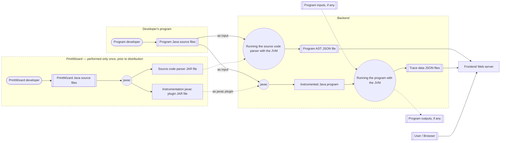
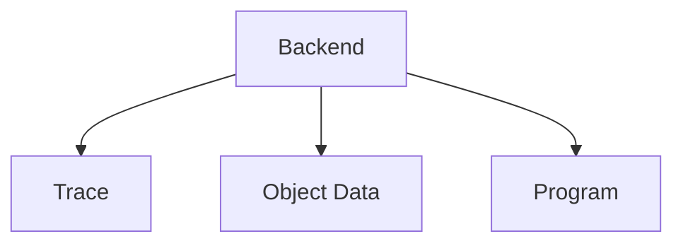
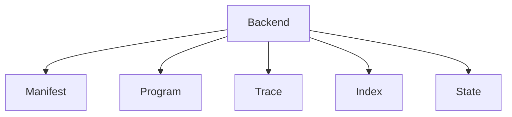
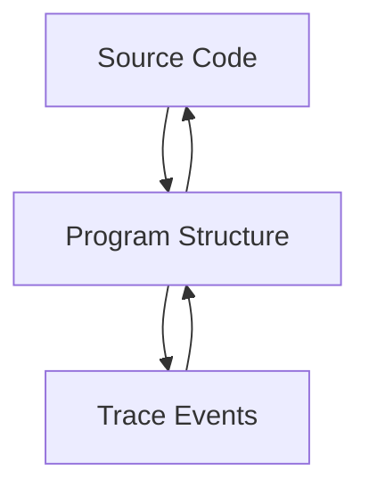
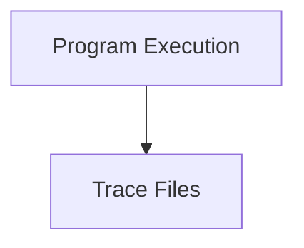
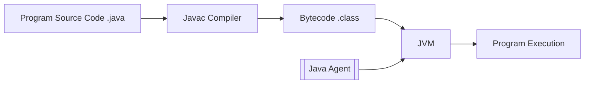
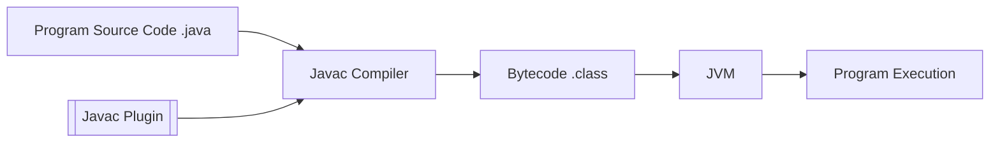

# Main Architecture of PrintWizard

<MermaidPanZoom>



</MermaidPanZoom>

---

# Previous Trace Format

<br>



---

# Short program example

<div class="max-h-100 overflow-auto rounded">

```java
public class Main {

    public static void main(String[] args) {
        int i = 3 + 2;

        if (i > 4) {
            System.out.println("i is greater than 4");
        }

        Player player = new Player(100);
        player.setHealthPoints(80);
    }

    public static class Player {
        private int healthPoints;

        public Player(int healthPoints) {
            this.healthPoints = healthPoints;
        }

        public void setHealthPoints(int healthPoints) {
            this.healthPoints = healthPoints;
        }
    }
}
```

</div>

---

# Trace

<div class="max-h-100 overflow-auto rounded">

```json
{
  "trace": [
    {
      "eventId": 0,
      "eventType": "controlFlow",
      "type": "GroupEvent",
      "pos": "start",
      "kind": {
        "type": "FunctionContext",
        "functionName": "main"
      }
    },
    {
      "eventId": 1,
      "eventType": "statement",
      "type": "GroupEvent",
      "pos": "start"
    },
    {
      "eventId": 2,
      "eventType": "subStatement",
      "type": "GroupEvent",
      "pos": "start"
    },
    {
      "eventId": 2,
      "eventType": "subStatement",
      "type": "GroupEvent",
      "pos": "end"
    },
    {
      "nodeKey": "Main.java-4:9-4:23",
      "assigns": [
        {
          "value": {
            "value": 5,
            "dataType": "int"
          },
          "identifier": {
            "name": "i",
            "parent": "-",
            "dataType": "localIdentifier"
          },
          "dataType": "write"
        }
      ],
      "type": "ExecutionStep",
      "kind": "expressionWithoutReturn"
    },
    {
      "eventId": 1,
      "eventType": "statement",
      "type": "GroupEvent",
      "pos": "end"
    },
    {
      "eventId": 3,
      "eventType": "statement",
      "type": "GroupEvent",
      "pos": "start"
    },
    {
      "eventId": 4,
      "eventType": "subStatement",
      "type": "GroupEvent",
      "pos": "start"
    },
    {
      "eventId": 4,
      "eventType": "subStatement",
      "type": "GroupEvent",
      "pos": "end"
    },
    {
      "eventId": 5,
      "eventType": "subStatement",
      "type": "GroupEvent",
      "pos": "start"
    },
    {
      "eventId": 5,
      "eventType": "subStatement",
      "type": "GroupEvent",
      "pos": "end"
    },
    {
      "result": {
        "value": true,
        "dataType": "bool"
      },
      "nodeKey": "Main.java-6:13-6:135",
      "assigns": [],
      "type": "ExecutionStep",
      "kind": "expression"
    },
    {
      "eventId": 3,
      "eventType": "statement",
      "type": "GroupEvent",
      "pos": "end"
    },
    {
      "eventId": 6,
      "eventType": "controlFlow",
      "type": "GroupEvent",
      "pos": "start",
      "kind": {
        "type": "DefaultContext"
      }
    },
    {
      "eventId": 7,
      "eventType": "statement",
      "type": "GroupEvent",
      "pos": "start"
    },
    {
      "eventId": 8,
      "eventType": "subStatement",
      "type": "GroupEvent",
      "pos": "start"
    },
    {
      "eventId": 8,
      "eventType": "subStatement",
      "type": "GroupEvent",
      "pos": "end"
    },
    {
      "stepId": 0,
      "argsValues": [
        {
          "value": "i is greater than 4",
          "dataType": "string"
        }
      ],
      "nodeKey": "Main.java-7:13-7:54",
      "type": "ExecutionStep",
      "kind": "logVoidCall"
    },
    {
      "eventId": 7,
      "eventType": "statement",
      "type": "GroupEvent",
      "pos": "end"
    },
    {
      "eventId": 6,
      "eventType": "controlFlow",
      "type": "GroupEvent",
      "pos": "end",
      "kind": {
        "type": "DefaultContext"
      }
    },
    {
      "eventId": 9,
      "eventType": "statement",
      "type": "GroupEvent",
      "pos": "start"
    },
    {
      "eventId": 10,
      "eventType": "subStatement",
      "type": "GroupEvent",
      "pos": "start"
    },
    {
      "stepId": 11,
      "argsValues": [
        {
          "value": 100,
          "dataType": "int"
        }
      ],
      "nodeKey": "Main.java-10:25-10:40",
      "type": "ExecutionStep",
      "kind": "logCall"
    },
    {
      "eventId": 12,
      "eventType": "controlFlow",
      "type": "GroupEvent",
      "pos": "start",
      "kind": {
        "type": "FunctionContext",
        "functionName": "<init>"
      }
    },
    {
      "eventId": 13,
      "eventType": "statement",
      "type": "GroupEvent",
      "pos": "start"
    },
    {
      "eventId": 14,
      "eventType": "subStatement",
      "type": "GroupEvent",
      "pos": "start"
    },
    {
      "eventId": 14,
      "eventType": "subStatement",
      "type": "GroupEvent",
      "pos": "end"
    },
    {
      "stepId": 0,
      "argsValues": [],
      "nodeKey": "absent",
      "type": "ExecutionStep",
      "kind": "logVoidCall"
    },
    {
      "eventId": 13,
      "eventType": "statement",
      "type": "GroupEvent",
      "pos": "end"
    },
    {
      "eventId": 15,
      "eventType": "statement",
      "type": "GroupEvent",
      "pos": "start"
    },
    {
      "eventId": 16,
      "eventType": "subStatement",
      "type": "GroupEvent",
      "pos": "start"
    },
    {
      "eventId": 16,
      "eventType": "subStatement",
      "type": "GroupEvent",
      "pos": "end"
    },
    {
      "result": {
        "value": 100,
        "dataType": "int"
      },
      "nodeKey": "Main.java-18:13-18:45",
      "assigns": [
        {
          "value": {
            "value": 100,
            "dataType": "int"
          },
          "identifier": {
            "name": "this.healthPoints",
            "parent": "-",
            "dataType": "localIdentifier"
          },
          "dataType": "write"
        }
      ],
      "type": "ExecutionStep",
      "kind": "expression"
    },
    {
      "eventId": 15,
      "eventType": "statement",
      "type": "GroupEvent",
      "pos": "end"
    },
    {
      "eventId": 12,
      "eventType": "controlFlow",
      "type": "GroupEvent",
      "pos": "end",
      "kind": {
        "type": "FunctionContext",
        "functionName": "<init>"
      }
    },
    {
      "stepId": 11,
      "result": {
        "className": {
          "className": "Player",
          "packageName": ""
        },
        "pointer": 295530567,
        "version": 1,
        "dataType": "instanceRef"
      },
      "nodeKey": "Main.java-10:25-10:40",
      "type": "ExecutionStep",
      "kind": "logReturn"
    },
    {
      "eventId": 10,
      "eventType": "subStatement",
      "type": "GroupEvent",
      "pos": "end"
    },
    {
      "nodeKey": "Main.java-10:9-10:41",
      "assigns": [
        {
          "value": {
            "className": {
              "className": "Player",
              "packageName": ""
            },
            "pointer": 295530567,
            "version": 3,
            "dataType": "instanceRef"
          },
          "identifier": {
            "name": "player",
            "parent": "-",
            "dataType": "localIdentifier"
          },
          "dataType": "write"
        }
      ],
      "type": "ExecutionStep",
      "kind": "expressionWithoutReturn"
    },
    {
      "eventId": 9,
      "eventType": "statement",
      "type": "GroupEvent",
      "pos": "end"
    },
    {
      "eventId": 17,
      "eventType": "statement",
      "type": "GroupEvent",
      "pos": "start"
    },
    {
      "eventId": 18,
      "eventType": "subStatement",
      "type": "GroupEvent",
      "pos": "start"
    },
    {
      "eventId": 18,
      "eventType": "subStatement",
      "type": "GroupEvent",
      "pos": "end"
    },
    {
      "stepId": 0,
      "argsValues": [
        {
          "value": 80,
          "dataType": "int"
        }
      ],
      "nodeKey": "Main.java-11:9-11:35",
      "type": "ExecutionStep",
      "kind": "logVoidCall"
    },
    {
      "eventId": 19,
      "eventType": "controlFlow",
      "type": "GroupEvent",
      "pos": "start",
      "kind": {
        "type": "FunctionContext",
        "functionName": "setHealthPoints"
      }
    },
    {
      "eventId": 20,
      "eventType": "statement",
      "type": "GroupEvent",
      "pos": "start"
    },
    {
      "eventId": 21,
      "eventType": "subStatement",
      "type": "GroupEvent",
      "pos": "start"
    },
    {
      "eventId": 21,
      "eventType": "subStatement",
      "type": "GroupEvent",
      "pos": "end"
    },
    {
      "result": {
        "value": 80,
        "dataType": "int"
      },
      "nodeKey": "Main.java-22:13-22:45",
      "assigns": [
        {
          "value": {
            "value": 80,
            "dataType": "int"
          },
          "identifier": {
            "name": "this.healthPoints",
            "parent": "-",
            "dataType": "localIdentifier"
          },
          "dataType": "write"
        }
      ],
      "type": "ExecutionStep",
      "kind": "expression"
    },
    {
      "eventId": 20,
      "eventType": "statement",
      "type": "GroupEvent",
      "pos": "end"
    },
    {
      "eventId": 19,
      "eventType": "controlFlow",
      "type": "GroupEvent",
      "pos": "end",
      "kind": {
        "type": "FunctionContext",
        "functionName": "setHealthPoints"
      }
    },
    {
      "eventId": 17,
      "eventType": "statement",
      "type": "GroupEvent",
      "pos": "end"
    },
    {
      "eventId": 0,
      "eventType": "controlFlow",
      "type": "GroupEvent",
      "pos": "end",
      "kind": {
        "type": "FunctionContext",
        "functionName": "main"
      }
    }
  ]
}
```

</div>

---

# Object Data

<div class="max-h-100 overflow-auto rounded">

```json
[
  {
    "self": {
      "className": {
        "className": "Player",
        "packageName": ""
      },
      "pointer": 295530567,
      "version": 1,
      "dataType": "instanceRef"
    },
    "fields": [
      {
        "identifier": {
          "owner": {
            "className": {
              "className": "Player",
              "packageName": ""
            },
            "pointer": 295530567,
            "version": 1,
            "dataType": "instanceRef"
          },
          "name": "healthPoints",
          "dataType": "fieldIdentifier"
        },
        "value": {
          "value": 100,
          "dataType": "int"
        }
      }
    ]
  },
  {
    "self": {
      "className": {
        "className": "Player",
        "packageName": ""
      },
      "pointer": 295530567,
      "version": 2,
      "dataType": "instanceRef"
    },
    "fields": [
      {
        "identifier": {
          "owner": {
            "className": {
              "className": "Player",
              "packageName": ""
            },
            "pointer": 295530567,
            "version": 2,
            "dataType": "instanceRef"
          },
          "name": "healthPoints",
          "dataType": "fieldIdentifier"
        },
        "value": {
          "value": 100,
          "dataType": "int"
        }
      }
    ]
  }
]
```

</div>

---

# Program

<div class="max-h-100 overflow-auto rounded">

```json
{
  "sourceFile": {
    "fileName": "Main.java",
    "packageName": ""
  },
  "syntaxNodes": {
    "Main.java-3:29-3:42": {
      "endLine": 3,
      "identifier": "Main.java-3:29-3:42",
      "expression": {
        "kind": "expression",
        "tokens": [
          {
            "kind": "Text",
            "text": "String[] args"
          }
        ]
      },
      "children": [],
      "kind": "presentInSourceCode",
      "prefix": {
        "kind": "Text",
        "text": "    public static void main("
      },
      "startLine": 3,
      "suffix": {
        "kind": "Text",
        "text": ") {\n"
      },
      "sourceFile": {
        "fileName": "Main.java",
        "packageName": ""
      }
    },
    "Main.java-17:23-17:39": {
      "endLine": 17,
      "identifier": "Main.java-17:23-17:39",
      "expression": {
        "kind": "expression",
        "tokens": [
          {
            "kind": "Text",
            "text": "int healthPoints"
          }
        ]
      },
      "children": [],
      "kind": "presentInSourceCode",
      "prefix": {
        "kind": "Text",
        "text": "        public Player("
      },
      "startLine": 17,
      "suffix": {
        "kind": "Text",
        "text": ") {\n"
      },
      "sourceFile": {
        "fileName": "Main.java",
        "packageName": ""
      }
    },
    "Main.java-6:13-6:14": {
      "endLine": 6,
      "identifier": "Main.java-6:13-6:14",
      "expression": {
        "kind": "expression",
        "tokens": [
          {
            "kind": "Text",
            "text": "i"
          }
        ]
      },
      "children": [],
      "kind": "presentInSourceCode",
      "prefix": {
        "kind": "Text",
        "text": "        if ("
      },
      "startLine": 6,
      "suffix": {
        "kind": "Text",
        "text": " > 4) {\n"
      },
      "sourceFile": {
        "fileName": "Main.java",
        "packageName": ""
      }
    },
    "Main.java-10:25-10:40": {
      "endLine": 10,
      "identifier": "Main.java-10:25-10:40",
      "expression": {
        "kind": "expression",
        "tokens": [
          {
            "kind": "Text",
            "text": "new Player("
          },
          {
            "kind": "Child",
            "text": "100",
            "childIndex": 0
          },
          {
            "kind": "Text",
            "text": ")"
          }
        ]
      },
      "children": [
        "absent"
      ],
      "kind": "presentInSourceCode",
      "prefix": {
        "kind": "Text",
        "text": "        Player player = "
      },
      "startLine": 10,
      "suffix": {
        "kind": "Text",
        "text": ";\n"
      },
      "sourceFile": {
        "fileName": "Main.java",
        "packageName": ""
      }
    },
    "Main.java-7:13-7:19": {
      "endLine": 7,
      "identifier": "Main.java-7:13-7:19",
      "expression": {
        "kind": "expression",
        "tokens": [
          {
            "kind": "Text",
            "text": "System"
          }
        ]
      },
      "children": [],
      "kind": "presentInSourceCode",
      "prefix": {
        "kind": "Text",
        "text": "            "
      },
      "startLine": 7,
      "suffix": {
        "kind": "Text",
        "text": ".out.println(\"i is greater than 4\");\n"
      },
      "sourceFile": {
        "fileName": "Main.java",
        "packageName": ""
      }
    },
    "Main.java-15:9-15:34": {
      "endLine": 15,
      "identifier": "Main.java-15:9-15:34",
      "expression": {
        "kind": "expression",
        "tokens": [
          {
            "kind": "Text",
            "text": "private int healthPoints;"
          }
        ]
      },
      "children": [],
      "kind": "presentInSourceCode",
      "prefix": {
        "kind": "Text",
        "text": "        "
      },
      "startLine": 15,
      "suffix": {
        "kind": "Text",
        "text": "\n"
      },
      "sourceFile": {
        "fileName": "Main.java",
        "packageName": ""
      }
    },
    "Main.java-10:9-10:15": {
      "endLine": 10,
      "identifier": "Main.java-10:9-10:15",
      "expression": {
        "kind": "expression",
        "tokens": [
          {
            "kind": "Text",
            "text": "Player"
          }
        ]
      },
      "children": [],
      "kind": "presentInSourceCode",
      "prefix": {
        "kind": "Text",
        "text": "        "
      },
      "startLine": 10,
      "suffix": {
        "kind": "Text",
        "text": " player = new Player(100);\n"
      },
      "sourceFile": {
        "fileName": "Main.java",
        "packageName": ""
      }
    },
    "Main.java-7:13-7:54": {
      "endLine": 7,
      "identifier": "Main.java-7:13-7:54",
      "expression": {
        "kind": "expression",
        "tokens": [
          {
            "kind": "Text",
            "text": "System.out.println("
          },
          {
            "kind": "Child",
            "text": "\"i is greater than 4\"",
            "childIndex": 0
          },
          {
            "kind": "Text",
            "text": ")"
          }
        ]
      },
      "children": [
        "absent"
      ],
      "kind": "presentInSourceCode",
      "prefix": {
        "kind": "Text",
        "text": "            "
      },
      "startLine": 7,
      "suffix": {
        "kind": "Text",
        "text": ";\n"
      },
      "sourceFile": {
        "fileName": "Main.java",
        "packageName": ""
      }
    },
    "Main.java-21:37-21:53": {
      "endLine": 21,
      "identifier": "Main.java-21:37-21:53",
      "expression": {
        "kind": "expression",
        "tokens": [
          {
            "kind": "Text",
            "text": "int healthPoints"
          }
        ]
      },
      "children": [],
      "kind": "presentInSourceCode",
      "prefix": {
        "kind": "Text",
        "text": "        public void setHealthPoints("
      },
      "startLine": 21,
      "suffix": {
        "kind": "Text",
        "text": ") {\n"
      },
      "sourceFile": {
        "fileName": "Main.java",
        "packageName": ""
      }
    },
    "Main.java-10:9-10:41": {
      "endLine": 10,
      "identifier": "Main.java-10:9-10:41",
      "expression": {
        "kind": "expression",
        "tokens": [
          {
            "kind": "Text",
            "text": "Player player = new Player(100);"
          }
        ]
      },
      "children": [],
      "kind": "presentInSourceCode",
      "prefix": {
        "kind": "Text",
        "text": "        "
      },
      "startLine": 10,
      "suffix": {
        "kind": "Text",
        "text": "\n"
      },
      "sourceFile": {
        "fileName": "Main.java",
        "packageName": ""
      }
    },
    "Main.java-4:9-4:23": {
      "endLine": 4,
      "identifier": "Main.java-4:9-4:23",
      "expression": {
        "kind": "expression",
        "tokens": [
          {
            "kind": "Text",
            "text": "int i = 3 + 2;"
          }
        ]
      },
      "children": [],
      "kind": "presentInSourceCode",
      "prefix": {
        "kind": "Text",
        "text": "        "
      },
      "startLine": 4,
      "suffix": {
        "kind": "Text",
        "text": "\n"
      },
      "sourceFile": {
        "fileName": "Main.java",
        "packageName": ""
      }
    },
    "Main.java-10:29-10:35": {
      "endLine": 10,
      "identifier": "Main.java-10:29-10:35",
      "expression": {
        "kind": "expression",
        "tokens": [
          {
            "kind": "Text",
            "text": "Player"
          }
        ]
      },
      "children": [],
      "kind": "presentInSourceCode",
      "prefix": {
        "kind": "Text",
        "text": "        Player player = new "
      },
      "startLine": 10,
      "suffix": {
        "kind": "Text",
        "text": "(100);\n"
      },
      "sourceFile": {
        "fileName": "Main.java",
        "packageName": ""
      }
    },
    "Main.java-4:17-4:175": {
      "endLine": 4,
      "identifier": "Main.java-4:17-4:175",
      "expression": {
        "kind": "expression",
        "tokens": [
          {
            "kind": "Text",
            "text": "3 + 2"
          }
        ]
      },
      "children": [],
      "kind": "presentInSourceCode",
      "prefix": {
        "kind": "Text",
        "text": "        int i = "
      },
      "startLine": 4,
      "suffix": {
        "kind": "Text",
        "text": ""
      },
      "sourceFile": {
        "fileName": "Main.java",
        "packageName": ""
      }
    },
    "Main.java-18:33-18:45": {
      "endLine": 18,
      "identifier": "Main.java-18:33-18:45",
      "expression": {
        "kind": "expression",
        "tokens": [
          {
            "kind": "Text",
            "text": "healthPoints"
          }
        ]
      },
      "children": [],
      "kind": "presentInSourceCode",
      "prefix": {
        "kind": "Text",
        "text": "            this.healthPoints = "
      },
      "startLine": 18,
      "suffix": {
        "kind": "Text",
        "text": ";\n"
      },
      "sourceFile": {
        "fileName": "Main.java",
        "packageName": ""
      }
    },
    "Main.java-18:13-18:45": {
      "endLine": 18,
      "identifier": "Main.java-18:13-18:45",
      "expression": {
        "kind": "expression",
        "tokens": [
          {
            "kind": "Text",
            "text": "this.healthPoints = healthPoints"
          }
        ]
      },
      "children": [],
      "kind": "presentInSourceCode",
      "prefix": {
        "kind": "Text",
        "text": "            "
      },
      "startLine": 18,
      "suffix": {
        "kind": "Text",
        "text": ";\n"
      },
      "sourceFile": {
        "fileName": "Main.java",
        "packageName": ""
      }
    },
    "Main.java-11:9-11:15": {
      "endLine": 11,
      "identifier": "Main.java-11:9-11:15",
      "expression": {
        "kind": "expression",
        "tokens": [
          {
            "kind": "Text",
            "text": "player"
          }
        ]
      },
      "children": [],
      "kind": "presentInSourceCode",
      "prefix": {
        "kind": "Text",
        "text": "        "
      },
      "startLine": 11,
      "suffix": {
        "kind": "Text",
        "text": ".setHealthPoints(80);\n"
      },
      "sourceFile": {
        "fileName": "Main.java",
        "packageName": ""
      }
    },
    "Main.java-22:13-22:17": {
      "endLine": 22,
      "identifier": "Main.java-22:13-22:17",
      "expression": {
        "kind": "expression",
        "tokens": [
          {
            "kind": "Text",
            "text": "this"
          }
        ]
      },
      "children": [],
      "kind": "presentInSourceCode",
      "prefix": {
        "kind": "Text",
        "text": "            "
      },
      "startLine": 22,
      "suffix": {
        "kind": "Text",
        "text": ".healthPoints = healthPoints;\n"
      },
      "sourceFile": {
        "fileName": "Main.java",
        "packageName": ""
      }
    },
    "Main.java-11:9-11:35": {
      "endLine": 11,
      "identifier": "Main.java-11:9-11:35",
      "expression": {
        "kind": "expression",
        "tokens": [
          {
            "kind": "Text",
            "text": "player.setHealthPoints("
          },
          {
            "kind": "Child",
            "text": "80",
            "childIndex": 0
          },
          {
            "kind": "Text",
            "text": ")"
          }
        ]
      },
      "children": [
        "absent"
      ],
      "kind": "presentInSourceCode",
      "prefix": {
        "kind": "Text",
        "text": "        "
      },
      "startLine": 11,
      "suffix": {
        "kind": "Text",
        "text": ";\n"
      },
      "sourceFile": {
        "fileName": "Main.java",
        "packageName": ""
      }
    },
    "Main.java-22:13-22:45": {
      "endLine": 22,
      "identifier": "Main.java-22:13-22:45",
      "expression": {
        "kind": "expression",
        "tokens": [
          {
            "kind": "Text",
            "text": "this.healthPoints = healthPoints"
          }
        ]
      },
      "children": [],
      "kind": "presentInSourceCode",
      "prefix": {
        "kind": "Text",
        "text": "            "
      },
      "startLine": 22,
      "suffix": {
        "kind": "Text",
        "text": ";\n"
      },
      "sourceFile": {
        "fileName": "Main.java",
        "packageName": ""
      }
    },
    "absent": {
      "identifier": "absent",
      "kind": "absent"
    },
    "Main.java-6:13-6:135": {
      "endLine": 6,
      "identifier": "Main.java-6:13-6:135",
      "expression": {
        "kind": "expression",
        "tokens": [
          {
            "kind": "Text",
            "text": "i > 4"
          }
        ]
      },
      "children": [],
      "kind": "presentInSourceCode",
      "prefix": {
        "kind": "Text",
        "text": "        if ("
      },
      "startLine": 6,
      "suffix": {
        "kind": "Text",
        "text": ""
      },
      "sourceFile": {
        "fileName": "Main.java",
        "packageName": ""
      }
    },
    "Main.java-22:33-22:45": {
      "endLine": 22,
      "identifier": "Main.java-22:33-22:45",
      "expression": {
        "kind": "expression",
        "tokens": [
          {
            "kind": "Text",
            "text": "healthPoints"
          }
        ]
      },
      "children": [],
      "kind": "presentInSourceCode",
      "prefix": {
        "kind": "Text",
        "text": "            this.healthPoints = "
      },
      "startLine": 22,
      "suffix": {
        "kind": "Text",
        "text": ";\n"
      },
      "sourceFile": {
        "fileName": "Main.java",
        "packageName": ""
      }
    },
    "Main.java-3:29-3:35": {
      "endLine": 3,
      "identifier": "Main.java-3:29-3:35",
      "expression": {
        "kind": "expression",
        "tokens": [
          {
            "kind": "Text",
            "text": "String"
          }
        ]
      },
      "children": [],
      "kind": "presentInSourceCode",
      "prefix": {
        "kind": "Text",
        "text": "    public static void main("
      },
      "startLine": 3,
      "suffix": {
        "kind": "Text",
        "text": "[] args) {\n"
      },
      "sourceFile": {
        "fileName": "Main.java",
        "packageName": ""
      }
    },
    "Main.java-18:13-18:17": {
      "endLine": 18,
      "identifier": "Main.java-18:13-18:17",
      "expression": {
        "kind": "expression",
        "tokens": [
          {
            "kind": "Text",
            "text": "this"
          }
        ]
      },
      "children": [],
      "kind": "presentInSourceCode",
      "prefix": {
        "kind": "Text",
        "text": "            "
      },
      "startLine": 18,
      "suffix": {
        "kind": "Text",
        "text": ".healthPoints = healthPoints;\n"
      },
      "sourceFile": {
        "fileName": "Main.java",
        "packageName": ""
      }
    }
  }
}
```

</div>

---

# Inspirations

<br>

<v-click>

- [Google Trace Event Format (TEF)](https://docs.google.com/document/d/1CvAClvFfyA5R-PhYUmn5OOQtYMH4h6I0nSsKchNAySU/preview?tab=t.0#heading=h.yr4qxyxotyw)

<br>

```json
{
  "displayTimeUnit": "ms",
  "traceEvents": [
    { "name": "process_name", "ph": "M", "pid": 100, "tid": 0, "args": { "name": "my_app" } },
    { "name": "thread_name",  "ph": "M", "pid": 100, "tid": 1, "args": { "name": "main" } },

    { "name": "LoadConfig", "cat": "startup", "ph": "X",
      "ts": 1200000, "dur": 3500, "pid": 100, "tid": 1,
      "args": { "path": "/etc/my_app/config.json" }
    },

    { "name": "CacheMiss", "cat": "cache", "ph": "i",
      "ts": 1202000, "pid": 100, "tid": 1,
      "s": "t",
      "args": { "key": "user:42" }
    }
  ]
}
```

</v-click>

<!--
TEF : Notions of Events
-->

---

# Inspirations

<br>
<v-click>

- [Birdseye](https://futurecoder.io/course/#ide)


</v-click>

<!--
Use of a database to store data
-->

---

# Inspirations

<br>
<v-click>

- [Python Tutor](https://futurecoder.io/course/#ide)


</v-click>

<!--
Use of a database to store data
-->

---

# New Trace Format

<br>

<v-click>



</v-click>

---

# Manifest

<div class="max-h-100 overflow-auto rounded">

```json
{
  "version" : "1.0.0",
  "generatedAt" : "2026-01-28T18:02:00.057755700",
  "fileLocations" : {
    "programFilePath" : "program.json",
    "traceFilePath" : "trace.json",
    "indexFilePath" : "index.json",
    "stateFilePath" : "state.json"
  }
}
```

</div>

---

# Program

<div class="max-h-100 overflow-auto rounded">

```json
{
  "sources" : [ {
    "sourceId" : "src:ch/epfl/printwizard/examples/example/Main.java",
    "path" : "Examples/src/main/java/ch/epfl/printwizard/examples/example/Main.java",
    "language" : "java",
    "lines" : 15
  }, {
    "sourceId" : "src:ch/epfl/printwizard/examples/example/Player.java",
    "path" : "Examples/src/main/java/ch/epfl/printwizard/examples/example/Player.java",
    "language" : "java",
    "lines" : 13
  } ],
  "classes" : [ {
    "id" : "cls:ch.epfl.printwizard.examples.example.Main",
    "name" : "Main",
    "packageName" : "ch.epfl.printwizard.examples.example",
    "sourceId" : "src:ch/epfl/printwizard/examples/example/Main.java"
  }, {
    "id" : "cls:ch.epfl.printwizard.examples.example.Player",
    "name" : "Player",
    "packageName" : "ch.epfl.printwizard.examples.example",
    "sourceId" : "src:ch/epfl/printwizard/examples/example/Player.java"
  } ],
  "interfaces" : [ ],
  "records" : [ ],
  "enums" : [ ],
  "methods" : [ {
    "methodId" : "m:ch.epfl.printwizard.examples.example.Main.main(String[])void",
    "classId" : "cls:ch.epfl.printwizard.examples.example.Main",
    "name" : "main",
    "returnType" : "void",
    "startLine" : 5,
    "endLine" : 14,
    "parameters" : [ {
      "index" : 0,
      "name" : "args",
      "typeId" : "t:String[]"
    } ],
    "structure" : {
      "structureId" : "block:2",
      "kind" : "BLOCK",
      "code" : null,
      "startPosition" : {
        "line" : 5,
        "column" : 44
      },
      "endPosition" : {
        "line" : 14,
        "column" : 5
      },
      "structures" : [ {
        "structureId" : "expr_stmt:1",
        "kind" : "EXPR_STMT",
        "code" : null,
        "startPosition" : {
          "line" : 6,
          "column" : 9
        },
        "endPosition" : {
          "line" : 6,
          "column" : 22
        },
        "expr" : {
          "code" : "int i = 3 + 2",
          "kind" : "ALL",
          "startPosition" : {
            "line" : 6,
            "column" : 9
          },
          "endPosition" : {
            "line" : 6,
            "column" : 22
          }
        }
      }, {
        "structureId" : "if:1",
        "kind" : "IF",
        "code" : "if (i > 4)",
        "startPosition" : {
          "line" : 8,
          "column" : 9
        },
        "endPosition" : {
          "line" : 10,
          "column" : 9
        },
        "condition" : {
          "code" : "i > 4",
          "kind" : "ALL",
          "startPosition" : {
            "line" : 8,
            "column" : 13
          },
          "endPosition" : {
            "line" : 8,
            "column" : 17
          }
        },
        "thenBranch" : {
          "structureId" : "block:1",
          "kind" : "BLOCK",
          "code" : null,
          "startPosition" : {
            "line" : 8,
            "column" : 20
          },
          "endPosition" : {
            "line" : 10,
            "column" : 9
          },
          "structures" : [ {
            "structureId" : "expr_stmt:2",
            "kind" : "EXPR_STMT",
            "code" : null,
            "startPosition" : {
              "line" : 9,
              "column" : 13
            },
            "endPosition" : {
              "line" : 9,
              "column" : 54
            },
            "expr" : {
              "code" : "System.out.println(\"i is greater than 4\")",
              "kind" : "ALL",
              "startPosition" : {
                "line" : 9,
                "column" : 13
              },
              "endPosition" : {
                "line" : 9,
                "column" : 54
              }
            }
          } ]
        },
        "elseBranch" : null
      }, {
        "structureId" : "expr_stmt:3",
        "kind" : "EXPR_STMT",
        "code" : null,
        "startPosition" : {
          "line" : 12,
          "column" : 9
        },
        "endPosition" : {
          "line" : 12,
          "column" : 40
        },
        "expr" : {
          "code" : "Player player = new Player(100)",
          "kind" : "ALL",
          "startPosition" : {
            "line" : 12,
            "column" : 9
          },
          "endPosition" : {
            "line" : 12,
            "column" : 40
          }
        }
      }, {
        "structureId" : "expr_stmt:4",
        "kind" : "EXPR_STMT",
        "code" : null,
        "startPosition" : {
          "line" : 13,
          "column" : 9
        },
        "endPosition" : {
          "line" : 13,
          "column" : 35
        },
        "expr" : {
          "code" : "player.setHealthPoints(80)",
          "kind" : "ALL",
          "startPosition" : {
            "line" : 13,
            "column" : 9
          },
          "endPosition" : {
            "line" : 13,
            "column" : 35
          }
        }
      } ]
    },
    "localVars" : [ {
      "index" : 1,
      "name" : "i",
      "typeId" : "int"
    }, {
      "index" : 2,
      "name" : "player",
      "typeId" : "Player"
    } ]
  }, {
    "methodId" : "m:ch.epfl.printwizard.examples.example.Player.Player(int)<init>",
    "classId" : "cls:ch.epfl.printwizard.examples.example.Player",
    "name" : "Player",
    "returnType" : "<init>",
    "startLine" : 6,
    "endLine" : 8,
    "parameters" : [ {
      "index" : 0,
      "name" : "healthPoints",
      "typeId" : "t:int"
    } ],
    "structure" : {
      "structureId" : "block:1",
      "kind" : "BLOCK",
      "code" : null,
      "startPosition" : {
        "line" : 6,
        "column" : 37
      },
      "endPosition" : {
        "line" : 8,
        "column" : 5
      },
      "structures" : [ {
        "structureId" : "expr_stmt:1",
        "kind" : "EXPR_STMT",
        "code" : null,
        "startPosition" : {
          "line" : 7,
          "column" : 9
        },
        "endPosition" : {
          "line" : 7,
          "column" : 41
        },
        "expr" : {
          "code" : "this.healthPoints = healthPoints",
          "kind" : "ALL",
          "startPosition" : {
            "line" : 7,
            "column" : 9
          },
          "endPosition" : {
            "line" : 7,
            "column" : 41
          }
        }
      } ]
    },
    "localVars" : [ ]
  }, {
    "methodId" : "m:ch.epfl.printwizard.examples.example.Player.setHealthPoints(int)void",
    "classId" : "cls:ch.epfl.printwizard.examples.example.Player",
    "name" : "setHealthPoints",
    "returnType" : "void",
    "startLine" : 10,
    "endLine" : 12,
    "parameters" : [ {
      "index" : 0,
      "name" : "healthPoints",
      "typeId" : "t:int"
    } ],
    "structure" : {
      "structureId" : "block:1",
      "kind" : "BLOCK",
      "code" : null,
      "startPosition" : {
        "line" : 10,
        "column" : 51
      },
      "endPosition" : {
        "line" : 12,
        "column" : 5
      },
      "structures" : [ {
        "structureId" : "expr_stmt:1",
        "kind" : "EXPR_STMT",
        "code" : null,
        "startPosition" : {
          "line" : 11,
          "column" : 9
        },
        "endPosition" : {
          "line" : 11,
          "column" : 41
        },
        "expr" : {
          "code" : "this.healthPoints = healthPoints",
          "kind" : "ALL",
          "startPosition" : {
            "line" : 11,
            "column" : 9
          },
          "endPosition" : {
            "line" : 11,
            "column" : 41
          }
        }
      } ]
    },
    "localVars" : [ ]
  } ]
}
```

</div>

---

# Trace

<div class="max-h-100 overflow-auto rounded">

```json
{
  "spans" : [ {
    "spanId" : "spn:1",
    "parentSpanId" : "null",
    "methodId" : "m:ch.epfl.printwizard.examples.example.Main.main(String[])void",
    "thisRef" : null,
    "args" : [ {
      "name" : "args",
      "value" : {
        "value" : null,
        "valueObjectId" : "obj:1",
        "type" : "java.lang.String[]",
        "kind" : "ARRAY",
        "objectVersion" : null
      },
      "type" : "String[]"
    } ],
    "startEventId" : "eve:1",
    "endEventId" : "eve:13",
    "startLoc" : {
      "sourceId" : "src:ch/epfl/printwizard/examples/example/Main.java",
      "line" : 5
    },
    "endLoc" : {
      "sourceId" : "src:ch/epfl/printwizard/examples/example/Main.java",
      "line" : 14
    }
  }, {
    "spanId" : "spn:2",
    "parentSpanId" : "spn:1",
    "methodId" : "m:ch.epfl.printwizard.examples.example.Player.Player(int)<init>",
    "thisRef" : "obj:2",
    "args" : [ {
      "name" : "healthPoints",
      "value" : {
        "value" : 100,
        "valueObjectId" : null,
        "type" : "int",
        "kind" : "PRIMITIVE",
        "objectVersion" : null
      },
      "type" : "int"
    } ],
    "startEventId" : "eve:7",
    "endEventId" : "eve:9",
    "startLoc" : {
      "sourceId" : "src:ch/epfl/printwizard/examples/example/Player.java",
      "line" : 6
    },
    "endLoc" : {
      "sourceId" : "src:ch/epfl/printwizard/examples/example/Player.java",
      "line" : 8
    }
  }, {
    "spanId" : "spn:3",
    "parentSpanId" : "spn:1",
    "methodId" : "m:ch.epfl.printwizard.examples.example.Player.setHealthPoints(int)void",
    "thisRef" : "obj:2",
    "args" : [ {
      "name" : "healthPoints",
      "value" : {
        "value" : 80,
        "valueObjectId" : null,
        "type" : "int",
        "kind" : "PRIMITIVE",
        "objectVersion" : null
      },
      "type" : "int"
    } ],
    "startEventId" : "eve:10",
    "endEventId" : "eve:12",
    "startLoc" : {
      "sourceId" : "src:ch/epfl/printwizard/examples/example/Player.java",
      "line" : 10
    },
    "endLoc" : {
      "sourceId" : "src:ch/epfl/printwizard/examples/example/Player.java",
      "line" : 12
    }
  } ],
  "events" : [ {
    "type" : "CALL",
    "eventId" : "eve:1",
    "spanId" : "spn:1",
    "location" : {
      "sourceId" : "src:ch/epfl/printwizard/examples/example/Main.java",
      "line" : 5
    },
    "callerMethodId" : "null",
    "calleeMethodId" : "m:ch.epfl.printwizard.examples.example.Main.main(String[])void",
    "name" : "main",
    "external" : false,
    "args" : [ {
      "name" : "args",
      "value" : {
        "value" : null,
        "valueObjectId" : "obj:1",
        "type" : "java.lang.String[]",
        "kind" : "ARRAY",
        "objectVersion" : null
      },
      "type" : "String[]"
    } ],
    "value" : null,
    "bodyEventIds" : [ "eve:2", "eve:3", "eve:6", "eve:10", "eve:13" ]
  }, {
    "type" : "LOCAL",
    "eventId" : "eve:2",
    "spanId" : "spn:1",
    "location" : {
      "sourceId" : "src:ch/epfl/printwizard/examples/example/Main.java",
      "line" : 6
    },
    "method" : "m:ch.epfl.printwizard.examples.example.Main.main(String[])void",
    "varName" : "i",
    "value" : {
      "value" : 5,
      "valueObjectId" : null,
      "type" : "int",
      "kind" : "PRIMITIVE",
      "objectVersion" : null
    },
    "label" : "local:i@src:ch/epfl/printwizard/examples/example/Main.java:130",
    "bodyEventId" : null
  }, {
    "type" : "CONDITION",
    "eventId" : "eve:3",
    "spanId" : "spn:1",
    "location" : {
      "sourceId" : "src:ch/epfl/printwizard/examples/example/Main.java",
      "line" : 8
    },
    "kind" : "IF_STATEMENT",
    "conditionEventIds" : [ "eve:4" ],
    "thenEventIds" : [ "eve:5" ],
    "elseEventIds" : [ ],
    "value" : {
      "value" : true,
      "valueObjectId" : null,
      "type" : "boolean",
      "kind" : "PRIMITIVE",
      "objectVersion" : null
    }
  }, {
    "type" : "COMPARISON",
    "eventId" : "eve:4",
    "spanId" : "spn:1",
    "location" : {
      "sourceId" : "src:ch/epfl/printwizard/examples/example/Main.java",
      "line" : 8
    },
    "operator" : "GT",
    "left" : {
      "value" : 5,
      "valueObjectId" : null,
      "type" : "int",
      "kind" : "PRIMITIVE",
      "objectVersion" : null
    },
    "leftEventId" : null,
    "right" : {
      "value" : 4,
      "valueObjectId" : null,
      "type" : "int",
      "kind" : "PRIMITIVE",
      "objectVersion" : null
    },
    "rightEventId" : null,
    "result" : {
      "value" : true,
      "valueObjectId" : null,
      "type" : "boolean",
      "kind" : "PRIMITIVE",
      "objectVersion" : null
    }
  }, {
    "type" : "CALL",
    "eventId" : "eve:5",
    "spanId" : "spn:1",
    "location" : {
      "sourceId" : "src:ch/epfl/printwizard/examples/example/Main.java",
      "line" : 9
    },
    "callerMethodId" : "m:ch.epfl.printwizard.examples.example.Main.main(String[])void",
    "calleeMethodId" : "-",
    "name" : "println",
    "external" : true,
    "args" : [ {
      "name" : "arg0",
      "value" : {
        "value" : "i is greater than 4",
        "valueObjectId" : null,
        "type" : "java.lang.String",
        "kind" : "PRIMITIVE",
        "objectVersion" : null
      },
      "type" : "java.lang.String"
    } ],
    "value" : null,
    "bodyEventIds" : [ ]
  }, {
    "type" : "CALL",
    "eventId" : "eve:7",
    "spanId" : "spn:2",
    "location" : {
      "sourceId" : "src:ch/epfl/printwizard/examples/example/Player.java",
      "line" : 6
    },
    "callerMethodId" : "m:ch.epfl.printwizard.examples.example.Main.main(String[])void",
    "calleeMethodId" : "m:ch.epfl.printwizard.examples.example.Player.Player(int)<init>",
    "name" : "<init>",
    "external" : false,
    "args" : [ {
      "name" : "healthPoints",
      "value" : {
        "value" : 100,
        "valueObjectId" : null,
        "type" : "int",
        "kind" : "PRIMITIVE",
        "objectVersion" : null
      },
      "type" : "int"
    } ],
    "value" : {
      "value" : null,
      "valueObjectId" : "obj:2",
      "type" : "ch.epfl.printwizard.examples.example.Player",
      "kind" : "OBJECT",
      "objectVersion" : 1
    },
    "bodyEventIds" : [ "eve:8", "eve:9" ]
  }, {
    "type" : "PUTFIELD",
    "eventId" : "eve:8",
    "spanId" : "spn:2",
    "location" : {
      "sourceId" : "src:ch/epfl/printwizard/examples/example/Player.java",
      "line" : 7
    },
    "objectId" : "obj:2",
    "fieldName" : "healthPoints",
    "value" : {
      "value" : 100,
      "valueObjectId" : null,
      "type" : "int",
      "kind" : "PRIMITIVE",
      "objectVersion" : null
    },
    "fieldType" : "int",
    "bodyEventId" : null
  }, {
    "type" : "RETURN",
    "eventId" : "eve:9",
    "spanId" : "spn:2",
    "location" : {
      "sourceId" : "src:ch/epfl/printwizard/examples/example/Player.java",
      "line" : 8
    },
    "value" : {
      "value" : null,
      "valueObjectId" : "obj:2",
      "type" : "ch.epfl.printwizard.examples.example.Player",
      "kind" : "OBJECT",
      "objectVersion" : null
    },
    "bodyEventId" : null
  }, {
    "type" : "LOCAL",
    "eventId" : "eve:6",
    "spanId" : "spn:1",
    "location" : {
      "sourceId" : "src:ch/epfl/printwizard/examples/example/Main.java",
      "line" : 12
    },
    "method" : "m:ch.epfl.printwizard.examples.example.Main.main(String[])void",
    "varName" : "player",
    "value" : {
      "value" : null,
      "valueObjectId" : "obj:2",
      "type" : "ch.epfl.printwizard.examples.example.Player",
      "kind" : "OBJECT",
      "objectVersion" : null
    },
    "label" : "local:player@src:ch/epfl/printwizard/examples/example/Main.java:250",
    "bodyEventId" : "eve:7"
  }, {
    "type" : "CALL",
    "eventId" : "eve:10",
    "spanId" : "spn:3",
    "location" : {
      "sourceId" : "src:ch/epfl/printwizard/examples/example/Player.java",
      "line" : 10
    },
    "callerMethodId" : "m:ch.epfl.printwizard.examples.example.Main.main(String[])void",
    "calleeMethodId" : "m:ch.epfl.printwizard.examples.example.Player.setHealthPoints(int)void",
    "name" : "setHealthPoints",
    "external" : false,
    "args" : [ {
      "name" : "healthPoints",
      "value" : {
        "value" : 80,
        "valueObjectId" : null,
        "type" : "int",
        "kind" : "PRIMITIVE",
        "objectVersion" : null
      },
      "type" : "int"
    } ],
    "value" : null,
    "bodyEventIds" : [ "eve:11", "eve:12" ]
  }, {
    "type" : "PUTFIELD",
    "eventId" : "eve:11",
    "spanId" : "spn:3",
    "location" : {
      "sourceId" : "src:ch/epfl/printwizard/examples/example/Player.java",
      "line" : 11
    },
    "objectId" : "obj:2",
    "fieldName" : "healthPoints",
    "value" : {
      "value" : 80,
      "valueObjectId" : null,
      "type" : "int",
      "kind" : "PRIMITIVE",
      "objectVersion" : null
    },
    "fieldType" : "int",
    "bodyEventId" : null
  } ]
}
```

</div>

---

# Index

<div class="max-h-100 overflow-auto rounded">

```json
{
  "byLine" : {
    "src:ch/epfl/printwizard/examples/example/Player.java" : {
      "11" : [ "eve:11" ],
      "6" : [ "eve:7" ],
      "7" : [ "eve:8" ],
      "8" : [ "eve:9" ],
      "10" : [ "eve:10" ]
    },
    "src:ch/epfl/printwizard/examples/example/Main.java" : {
      "12" : [ "eve:6" ],
      "5" : [ "eve:1" ],
      "6" : [ "eve:2" ],
      "8" : [ "eve:3", "eve:4" ],
      "9" : [ "eve:5" ]
    }
  },
  "byLocal" : {
    "local:player@src:ch/epfl/printwizard/examples/example/Main.java:250#spn:1" : [ "eve:6" ],
    "local:i@src:ch/epfl/printwizard/examples/example/Main.java:130#spn:1" : [ "eve:2" ]
  },
  "byObject" : {
    "obj:2" : [ "eve:8", "eve:9", "eve:6", "eve:11" ]
  },
  "bySpan" : {
    "spn:1" : [ "eve:1" ],
    "spn:3" : [ "eve:10" ],
    "spn:2" : [ "eve:7" ]
  }
}
```

</div>

---

# State

<div class="max-h-100 overflow-auto rounded">

```json
{
  "objects" : {
    "obj:2" : {
      "objectId" : "obj:2",
      "type" : "ch.epfl.printwizard.examples.example.Player",
      "timeline" : [ {
        "version" : 1,
        "eventId" : "eve:8",
        "fields" : {
          "healthPoints" : {
            "type" : "int",
            "value" : 100,
            "objectId" : null
          }
        }
      }, {
        "version" : 2,
        "eventId" : "eve:11",
        "fields" : {
          "healthPoints" : {
            "type" : "int",
            "value" : 80,
            "objectId" : null
          }
        }
      } ]
    }
  }
}
```

</div>

---

# Backend

<br>
<div class="grid grid-cols-2 gap-16 mt-18 items-start">
<v-click>
    <div class="flex flex-col items-center gap-10">
        <div class="text-3xl opacity-80">Static Extraction</div>
        <div class="i-bi-gear-wide-connected text-9xl opacity-80"></div>
    </div>
</v-click>
<v-click>
    <div class="flex flex-col items-center gap-10">
        <div class="text-3xl opacity-80">Instrumentation</div>
        <div class="i-bi-gear-wide-connected text-9xl opacity-80"></div>
    </div>
</v-click>
</div>

---

# Static Extraction

<br>



<!--
Link between source code and trace events
-->

---

# Static Extraction

<br>

<v-click>

- [Java Parser](https://javaparser.org/)


</v-click>

<br>
<v-click>
<div class="callout-red">
  <span class="badge-excl">!</span>
  Java Parser does not know if the code has been executed or not.
</div>
</v-click>

---

# Instrumentation

<br>
<v-click>

- Modify the behaviour of the program to collect runtime data.
</v-click>

<br>
<v-click>
<br>
<div class="callout-gray">
  <span class="badge-gray">?</span>
  Why do we need instrumentation?
</div>
</v-click>

<br>
<v-click>



</v-click>

---

# Instrumentation

<br>
<div class="grid grid-cols-2 gap-16 mt-18 items-start">
<v-click>
    <div class="flex flex-col items-center gap-10">
        <div class="text-3xl opacity-80">Java Agent</div>
        <div class="i-bi-hammer text-9xl opacity-80"></div>
    </div>
</v-click>
<v-click>
    <div class="flex flex-col items-center gap-10">
        <div class="text-3xl opacity-80">Javac Plugin</div>
        <div class="i-bi-bricks text-9xl opacity-80"></div>
    </div>
</v-click>
</div>

---

# Instrumentation Toolchain

<br>

<v-click>



</v-click>
<br>
<v-click>



</v-click>
---

# Java Agent

<br>

<v-click>

- Runtime instrumentation of Java bytecode

</v-click>

<v-click>

- Couple with ASM library for bytecode manipulation
<br>

</v-click>

<v-click>

- Does not require the source code
</v-click>

---

# Java Agent

<br>

<v-click>
<div class="callout-gray">
  <span class="badge-gray">?</span>
  Why I started with Java Agent?
</div>
</v-click>

<br>
<v-clicks>

- I did not check enough why the flaws of the first backend (Javac Plugin) were happening.

</v-clicks>

<!--

-->

---

# How to instrument with Java Agent?

<br>

<v-clicks>

- Detect a specific bytecode instruction (e.g., the addition for 3 + 5)
- Inject a call to our own method when that instruction is executed
- Our method will log the necessary data to a trace file

</v-clicks>

<br>
<v-click>
        
```java
public class Main {

  public static void main(String[] args) {
    int i = 3 + 5;
  }

}
```

</v-click>
<br>
<v-click>

```
ICONST_3
ICONST_5
IADD
ISTORE
```

</v-click>

---

# How to instrument with Java Agent?

<br>
<div class="max-h-100 overflow-auto rounded">
<v-click>

```java
@Override
public void visitVarInsn(int opcode, int var) {
    switch (opcode) {
        case ISTORE, LSTORE, FSTORE, DSTORE, ASTORE : {
            String desc = switch (opcode) {
                case ISTORE -> "I";
                case LSTORE -> "J";
                case FSTORE -> "F";
                case DSTORE -> "D";
                default -> "Ljava/lang/Object;";
            };

            // long and double take two slots
            if (opcode == LSTORE || opcode == DSTORE) {
                dup2();
            } else {
                dup();
            }
            
            super.visitVarInsn(opcode, var);
            
            Type t = Type.getType(desc);
            if (t.getSort() != Type.OBJECT && t.getSort() != Type.ARRAY) box(t);

            // push args and swap the result (mId, res, name) -> (mId, name, res)
            push(ownerInternal); swap();
            push(methodId); swap();
            push(String.valueOf(var)); swap();
            push(var); swap();

            pushSourceIdAndLine();
            invokeStatic(Type.getType(TraceSink.class), new Method("logLocal",
                    "(Ljava/lang/String;Ljava/lang/String;Ljava/lang/String;ILjava/lang/Object;Ljava/lang/String;I)V"));
            
            return;
        }
        default: {
            super.visitVarInsn(opcode, var);
        }
    }
}
```
</v-click>
</div>

---

# Why Javac Plugin was not working?

<br>

<v-click>

- Difficult, many edge cases and low-level APIs to manipulate ASTs and bytecode
  - Some types take two slots (long, double) in the stack.
  - Different bytecode instructions for different types (```ISTORE```, ```ASTORE```, ```FSTORE```, ```DSTORE```, ```LSTORE```)
</v-click>
<v-click>

- The results of conditions often do not exist at runtime.

<br>

```java
if (x > 10) { ... }
if ("hello".length() > 5) { ... }
```

</v-click>

<br>
<v-click>

- Nearly impossible to distinguish between different kinds of structures (loops vs. conditionals).

</v-click>

---

# Javac Plugin

<br>

<v-click>

- Compile-time instrumentation of Java source code
- Manipulate the Abstract Syntax Tree (AST) of the program

</v-click>

<br>

<v-click>

````md magic-move
```java
int i = 5;
```

```java
int i = TraceOut.recordLocal(5, ...);
```

```java
int i = TraceOut.endLocal(TraceOut.beginLocal(...), 5);
```
````

</v-click>

---

# Javac Plugin

<br>
<v-click>

````md magic-move
```java
int i = 5 + 3;
```

```java
int i = TraceOut.endArithmetic(TraceOut.beginArithmetic("+", ...), 5 + 3);
```

```java
String arId = TraceOut.beginArithmetic("+", ...);

// left operand
TraceOut.beginArithmeticLeft();
int _l = TraceOut.endArithmeticLeft(arId, 5);

// right operand
TraceOut.beginArithmeticRight();
int _r = TraceOut.endArithmeticRight(arId, 3);

// compute once, then close the arithmetic event
int _res = _l + _r;
int i = TraceOut.endArithmetic(arId, _l, _r, _res);
```

```java
// int i = 5 + 3;
String localId = TraceOut.beginLocal("i", ...);

String arId = TraceOut.beginArithmetic("+", ...);

// left operand
TraceOut.beginArithmeticLeft();
int _l = TraceOut.endArithmeticLeft(arId, 5);

// right operand
TraceOut.beginArithmeticRight();
int _r = TraceOut.endArithmeticRight(arId, 3);

// close arithmetic (compute once)
int _res = _l + _r;
int rhs = TraceOut.endArithmetic(arId, _l, _r, _res);

// close local write + produce assigned value
int i = TraceOut.endLocal(localId, rhs);
```
````

</v-click>

---

# Main Challenges with Javac Plugin

<br>

<v-click>

- Handling all edge cases of Java syntax and semantics

<br>

```java
if (condition1 && condition2) {... }
```

<br>

```java
this.healthPoints = 100;

healthPoints = 100
```

<br>
</v-click>

<v-click>
- Correctly linking the instrumentation data with the static extraction

</v-click>

---

# Linking Static Extraction and Instrumentation

<br>
<v-click>
<div class="callout-gray">
  <span class="badge-gray">?</span>
  How to link static extraction with the instrumentation data?
</div>
</v-click>

<v-click>
<br>

- Use unique IDs for methods, variables, and structures
- These IDs are generated the same way in both the static extractor and the instrumentation tool

</v-click>

<v-click>
<br>

```
m:ch.epfl.printwizard.examples.example.Main.main(String[])void

src:ch/epfl/printwizard/examples/example/Player.java
```

</v-click>

---

# Instrumented language constructs

<br>
<v-clicks>

- Local variable declarations and assignments
- Field assignments
- Array creations and assignments
- Object instantiations
- Conditional statements (if / else if / else)
- Loop statements (for / while / do while)
- Method calls
- Return statements

</v-clicks>

---

# Instrumented language constructs

<br>
<v-clicks>

- Arithmetic operations (+, -, *, /, %)
- Comparison operations (==, !=, >, <, >=, <=)
- Logical operations (&&, ||, !)
- Unary operations (++, --, unary -)
- Assignment operations (=, +=, -=, *=, /=, %=)

</v-clicks>

---

# Instrumented language constructs

<br>
<v-click>
<div class="callout-red">
  <span class="badge-excl">!</span>
  What remains uninstrumented / too buggy to be used reliably?
</div>
</v-click>
<br>
<v-clicks>

- Ternary operators (condition ? expr1 : expr2)
  - 90% done, but do not work well in nested cases
- Enhanced for-loops (for-each loops)
- Switch statements
- Try-catch-finally blocks
- Lambda expressions
- Synchronized blocks and methods

</v-clicks>

---
class: flex items-center justify-center text-center
---

# It is time to debug the cheese simulator!

---

# Future work: Backend Improvements

<br>
<v-clicks>

- Improve the Javac Plugin to handle more edge cases and language constructs
- Implementation of unit tests

</v-clicks>

---

# Future work: Frontend Improvements

<br>
<v-clicks>

- Implementation of other views / inspectors
- Improve the usability and design of the UI (e.g., dark mode, keyboard shortcuts)

</v-clicks>

---

# Future work: Setup and Documentation

<br>
<v-clicks>

- Improve the setup process for developers
- Create comprehensive documentation and tutorials for users

</v-clicks>

---

# Conclusion for a (soon-to-be-no longer?) student

<br>
<v-clicks>

- Self-reflection on the challenges faced during the development of PrintWizard
- Happy with the final results, despite the initial struggles
- Gained valuable experience in Java instrumentation and program analysis
- Lessons learned about Java instrumentation
- PrintWizard has a clear path towards becoming a robust and user-friendly tool for Java program analysis.

</v-clicks>

---

# Conclusion for PrintWizard

<br>
<v-clicks>

- PrintWizard has a clear path towards becoming a robust and user-friendly tool for Java program analysis.
- Happy to contribute again
</v-clicks>

---

# Acknowledgements

<br>
<v-clicks>

- Shardul Chiplunkar, my supervisor, for his guidance and support throughout the project.
- Pr. Clément Pit-Claudel, for his valuable feedback and insights during the project.
- SYSTEMF lab, for providing the resources and environment to work on this project.

</v-clicks>

---
class: flex items-center justify-center text-center
---

# Questions?