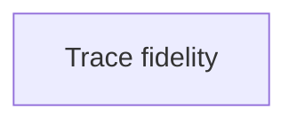
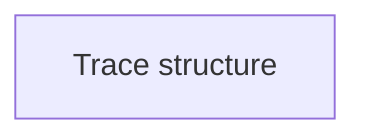
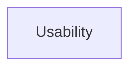

# Coding is fun.  

<br>
<p>Developers can build amazing things, solve complex problems, and bring ideas to life.</p>

<v-click>

</v-click>

<!--
For instance, I really like videogames, so I created one during my bachelor's degree.
-->

---

# Developers are human.

<br>
<p>And humans make mistakes.</p>

<v-click>
<div class="callout-red">
  <span class="badge-excl">!</span>
  Even the most experienced developers are susceptible to make mistakes while coding.
</div>
</v-click>

<!--
A mistake often results in a bug in the code, which can lead to unexpected behavior or crashes.
-->

---

# Bugs are inevitable.

<br>
<v-clicks>

- Human factors
- Requirements misunderstandings
- Integration problems
- Data issues
- ...

</v-clicks>
<br>
<v-click>
<div class="callout-gray">
  <span class="badge-gray">?</span>
  How to fix bugs within your program?
</div>
</v-click>

<!--
Can be the cause of lots of things:

Human Factors (typos, copy/paste, merge conflicts, fatigue)
Requirements misunderstandings (unclear specifications, wrong assumptions)
Integration problems (API changes, dependency issues)
Data issues (invalid input, unexpected formats)

As a developer, you are guaranteed to introduce bugs in your code at some point.
-->

---

# Example #1.

<br>

```java
import java.util.List;

public class Main {
  static double average(List<Integer> xs) {
    int sum = 0;
    for (int i = 0; i < xs.size(); i++) sum += xs.get(i);

    return sum / xs.size();
  }

  public static void main(String[] args) {
    var xs = List.of(1, 2, 2);
    System.out.println("avg = " + average(xs));
  }
}
```

<br>
<v-click>
```text
avg = 1.0
```
</v-click>
<v-click>

Problem: `avg` prints **1.0** but we expect **1.666…**
</v-click>

<!--
If we compute by hand, we find that the average of [1, 2, 2] is (1 + 2 + 2) / 3 = 5 / 3 = 1.666…
-->

---

# How to fix this bug?

<br>
Two main strategies:

<div class="grid grid-cols-2 gap-16 mt-18 items-start">
<v-click>
    <div class="flex flex-col items-center gap-10">
        <div class="text-3xl opacity-80">Logging</div>
        <div class="i-bi-window text-9xl opacity-80"></div>
    </div>
</v-click>
<v-click>
    <div class="flex flex-col items-center gap-10">
        <div class="text-3xl opacity-80">Traditional debugger</div>
        <div class="i-bi-gear-wide-connected text-9xl opacity-80"></div>
    </div>
</v-click>
</div>
---

# Logging.

<br>

````md magic-move
```java
static double average(List<Integer> xs) {
  int sum = 0;
  for (int i = 0; i < xs.size(); i++)
    sum += xs.get(i);
  return sum / xs.size();
}
```

```java
static double average(List<Integer> xs) {
  int sum = 0;
  System.out.println("xs = " + xs);

  for (int i = 0; i < xs.size(); i++)
    sum += xs.get(i);

  return sum / xs.size();
}
```

```java
static double average(List<Integer> xs) {
  int sum = 0;
  System.out.println("xs = " + xs);

  for (int i = 0; i < xs.size(); i++) {
    int x = xs.get(i);
    sum += x;
    System.out.println("i=" + i + " x=" + x + " sum=" + sum);
  }

  return sum / xs.size();
}
```

```java
static double average(List<Integer> xs) {
  int sum = 0;
  System.out.println("xs = " + xs);

  for (int i = 0; i < xs.size(); i++) {
    int x = xs.get(i);
    sum += x;
    System.out.println("i=" + i + " x=" + x + " sum=" + sum);
  }

  System.out.println("final sum=" + sum + " size=" + xs.size());

  return sum / xs.size();
}
```

```java
static double average(List<Integer> xs) {
  int sum = 0;
  System.out.println("xs = " + xs);

  for (int i = 0; i < xs.size(); i++) {
    int x = xs.get(i);
    sum += x;
    System.out.println("i=" + i + " x=" + x + " sum=" + sum);
  }

  System.out.println("final sum=" + sum + " size=" + xs.size());
  System.out.println("sum / size (int division) = " + (sum / xs.size()));

  return sum / xs.size();
}
```

```java{14}
static double average(List<Integer> xs) {
  int sum = 0;
  System.out.println("xs = " + xs);

  for (int i = 0; i < xs.size(); i++) {
    int x = xs.get(i);
    sum += x;
    System.out.println("i=" + i + " x=" + x + " sum=" + sum);
  }

  System.out.println("final sum=" + sum + " size=" + xs.size());
  System.out.println("sum / size (int division) = " + (sum / xs.size()));

  return sum / (double) xs.size();
}
```
````

---

# Traditional debugger.

<br>

````md magic-move
```java
static double average(List<Integer> xs) {
  int sum = 0;
  for (int i = 0; i < xs.size(); i++)
    sum += xs.get(i);
  return sum / xs.size();
}
```

```java
  static double average(List<Integer> xs) {
    int sum = 0;
    for (int i = 0; i < xs.size(); i++)
      sum += xs.get(i);
🔴   return sum / xs.size();
  }
```
````

---

# The classic debugging cycle.

<br>
<v-clicks>

1. Observe the bug, reproduce it
2. Form a hypothesis about its cause: "I think the problem is here"
3. Add print statements or use a debugger to inspect the program state (add breakpoints)
4. Analyze the output to confirm or refute your hypothesis
5. If confirmed, fix the bug. If refuted, form a new hypothesis and repeat <bi-arrow-repeat />
</v-clicks>

<br>
<v-click>
<div class="callout-gray">
  <span class="badge-gray">?</span>
  What happens if the developer can't find a viable hypothesis?
</div>
</v-click>

<!--
What happens if the hypothesis is wrong? If the developer can't find a viable hypothesis?
-->

---

# Example #2.

<br>
<v-clicks>

- I put a neutral cheese batch in a cellar
- Each day (turn), a random effect happens to the batch (good or bad)
- At the end, we ask a cheese maker (the classifier) what cheese we produced

</v-clicks>

<v-click>

</v-click>

---

# Example #2 : Batch attributes.

<br>
<v-clicks>

- **humidity** and **temperature** of the cellar
- **rindIntegrity**
- **moldRisk**
- **salt**
- temporary status:
  - **brineBarrier** (absorbs incoming mold growth)
  - **contaminationStacks** (amplifies mold growth)

</v-clicks>

---

# Example #2 : Turn logic.

<br>

Each turn:

<v-clicks>

  1. passive decay + background rules (`tickStatus`)
  2. apply one **Effect** at random
  3. clamp batch attributes to valid ranges
  4. record cellar history (moving averages)

</v-clicks>

---

# Example #2 : Effects.

<br>

Each turn:

<br>

<v-clicks>

- `HUMIDITY_CHANGE(±points)` → Change the humidity
- `TEMP_CHANGE(±°C)` → Change the temperature
- `BRINE_WASH(+barrier)` → adds barrier + increases salt
- `TURN_CHEESE(effort)` → reduces mold risk
- `CONTAMINATION(+stacks)` → increases future mold scaling
- `MOLD_GROWTH(raw, source)` → main damage pipeline
- `OPEN_DOOR(humiditySpikePermille, tempDropC)` → sudden shock event

</v-clicks>

---

# Example #2 : The classifier.

<br>

<v-clicks>

- The classifier uses:
  - `avgHumidity()` and `avgTemp()` over a sliding window
  - plus end-state: `rindIntegrity`, `moldRisk`, `salt`
- It matches ranges:
  - **GRUYERE** wants: stable 10–14°C, 85–92% avg humidity, low mold risk, strong rind
  - **VACHERIN** wants: very humid, cool, softer rind
  - **RACLETTE** wants: humid bands + higher salt, controlled mold

</v-clicks>

---

# Example #2 : The bug.

<br>
<v-click>
<div class="callout-red">
  <span class="badge-excl">!</span>
  After running many simulations, we notice that the classifier often misclassifies certain batches.
</div>
</v-click>

<br>
<v-click>
<div class="callout-gray">
  <span class="badge-gray">?</span>
  Is it possible to debug this simulation to identify and fix the misclassification issue with the two presented strategies?
</div>
</v-click>

---

# Example #2 : Debugging.

<br>

1. Observe the bug, reproduce it
2. Form a hypothesis about its cause: "I think the problem is here"
3. Add print statements or use a debugger to inspect the program state (add breakpoints)
4. Analyze the output to confirm or refute your hypothesis
5. If confirmed, fix the bug. If refuted, form a new hypothesis and repeat <bi-arrow-repeat />

<br>
<v-click>
<div class="callout-gray">
  <span class="badge-gray">?</span>
  Where the batch process breaks down?
</div>
</v-click>

<!--
The developer must know where to look, what to inspect, and what to expect. Where to place print statements or breakpoints.
-->

---

# Where the process breaks down?

<br>

<div class="max-h-100 overflow-auto rounded">

```java
package ch.epfl.printwizard.examples.cheese;

import java.util.*;

public final class Main {

    public static void main(String[] args) {
        long seed = 1234567890L;
        Simulation sim = new Simulation(seed);

        Batch batch = new Batch("Batch-01");
        List<Effect> effects = sim.generateEffects(50);

        for (int turn = 0; turn < effects.size(); turn++) {
            sim.applyEffect(batch, effects.get(turn), turn);
        }

        CheeseType cheese = CheeseClassifier.classify(batch);
        System.out.println("Final: " + batch.debugString());
        System.out.println("Resulting cheese: " + cheese);
        System.out.println("Why: " + CheeseClassifier.explain(batch, cheese));
    }

    enum MoldSource { AMBIENT, HANDLING }

    enum CheeseType { GRUYERE, RACLETTE, APPENZELLER, VACHERIN, EMMENTAL, FAILED_BATCH, UNKNOWN }

    private static final class Simulation {
        private final Random rng;

        Simulation(long seed) {
            this.rng = new Random(seed);
        }

        List<Effect> generateEffects(int n) {
            List<Effect> out = new ArrayList<>(n);
            for (int i = 0; i < n; i++) out.add(randomEffect());
            return out;
        }

        private Effect randomEffect() {
            int roll = rng.nextInt(100);

            if (roll < 32) return Effect.humidityChange(-2 + rng.nextInt(5));
            if (roll < 54) return Effect.tempChange(-1 + rng.nextInt(3));

            if (roll < 67) return Effect.brineWash(2 + rng.nextInt(7));
            if (roll < 77) return Effect.turnCheese(1 + rng.nextInt(3));

            if (roll < 88) return Effect.contamination(1 + rng.nextInt(2));

            if (roll < 95) return Effect.openDoor(50 + rng.nextInt(151), 1 + rng.nextInt(3));

            MoldSource src;
            if (rng.nextInt(100) < 75) src = MoldSource.AMBIENT;
            else src = MoldSource.HANDLING;

            return Effect.moldGrowth(3 + rng.nextInt(10), src);
        }

        void applyEffect(Batch batch, Effect effect, int turn) {
            tickStatus(batch, turn);

            if (effect.type == Effect.Type.HUMIDITY_CHANGE) handleHumidityChange(batch, effect.a);
            else if (effect.type == Effect.Type.TEMP_CHANGE) handleTempChange(batch, effect.a);
            else if (effect.type == Effect.Type.BRINE_WASH) handleBrineWash(batch, effect.a);
            else if (effect.type == Effect.Type.TURN_CHEESE) handleTurnCheese(batch, effect.a);
            else if (effect.type == Effect.Type.CONTAMINATION) handleContamination(batch, effect.a);
            else if (effect.type == Effect.Type.OPEN_DOOR) handleOpenDoor(batch, effect.a, effect.b);
            else if (effect.type == Effect.Type.MOLD_GROWTH) handleMoldGrowth(batch, effect.a, effect.source, turn);

            clamp(batch);
            batch.env.record(batch.humidity, batch.temperature);
        }

        private void tickStatus(Batch batch, int turn) {
            batch.status.decayBarrier();
            batch.status.decayContamination();

            if (turn % 19 == 0) batch.humidity += 1;

            if (batch.humidity >= 95) batch.moldRisk += 2;

            if (batch.temperature >= 16) batch.moldRisk += 1;

            if (turn % 23 == 0 && batch.env.isStable()) batch.rindIntegrity += 1;
        }

        private void handleHumidityChange(Batch batch, int deltaPoints) {
            batch.humidity += deltaPoints;
        }

        private void handleTempChange(Batch batch, int deltaC) {
            batch.temperature += deltaC;
        }

        private void handleBrineWash(Batch batch, int amount) {
            batch.status.addBrineBarrier(amount);
            batch.salt += Math.max(0, amount / 2);
        }

        private void handleTurnCheese(Batch batch, int effort) {
            batch.moldRisk -= 2 * Math.max(1, effort);
        }

        private void handleContamination(Batch batch, int stacks) {
            batch.status.addContamination(stacks);
        }

        private void handleOpenDoor(Batch batch, int humiditySpikePermille, int tempDropC) {
            // --- BUG HERE ---
            batch.humidity += humiditySpikePermille / 10;

            batch.temperature -= Math.max(0, tempDropC);

            batch.moldRisk += 3;
        }

        private void handleMoldGrowth(Batch batch, int raw, MoldSource source, int turn) {
            int multiplier = 1 + batch.status.contaminationStacks;
            int scaled = raw * multiplier;

            int incoming = scaled;
            if (batch.humidity >= 92) {
                incoming = scaled + 4;
            }

            if (rng.nextInt(100) < 7) incoming += 3;

            int absorbed = batch.status.absorbWithBrineBarrier(incoming);
            int remaining = incoming - absorbed;

            batch.rindIntegrity -= Math.max(0, remaining / 2);

            if (source == MoldSource.AMBIENT) batch.moldRisk += incoming / 6;
            else batch.moldRisk += incoming / 8;

            if (source == MoldSource.HANDLING && turn % 37 == 0 && rng.nextInt(100) < 25) {
                batch.rindIntegrity -= 2;
                batch.moldRisk += 2;
            }
        }

        private void clamp(Batch batch) {
            batch.humidity = Math.max(0, Math.min(100, batch.humidity));
            batch.temperature = Math.max(2, Math.min(20, batch.temperature));

            batch.moldRisk = Math.max(0, Math.min(100, batch.moldRisk));
            batch.rindIntegrity = Math.max(0, Math.min(100, batch.rindIntegrity));
            batch.salt = Math.max(0, Math.min(100, batch.salt));
        }
    }

    private static final class Batch {
        final String id;

        int humidity = 88;
        int temperature = 12;

        int rindIntegrity = 80;
        int moldRisk = 10;
        int salt = 30;

        final Status status = new Status();
        final EnvWindow env = new EnvWindow(50);

        Batch(String id) {
            this.id = id;
            this.env.record(humidity, temperature);
        }

        String debugString() {
            return "Batch{id=" + id
                + ", H=" + humidity + "%, T=" + temperature + "C"
                + ", rind=" + rindIntegrity
                + ", moldRisk=" + moldRisk
                + ", salt=" + salt
                + ", barrier=" + status.brineBarrier
                + ", contam=" + status.contaminationStacks
                + ", avgH=" + env.avgHumidity()
                + ", avgT=" + env.avgTemp()
                + "}";
        }
    }

    private static final class Status {
        int brineBarrier = 0;
        int contaminationStacks = 0;

        void addBrineBarrier(int amount) {
            brineBarrier += Math.max(0, amount);
        }

        void addContamination(int stacks) {
            contaminationStacks = Math.min(6, contaminationStacks + Math.max(0, stacks));
        }

        void decayBarrier() {
            if (brineBarrier > 0) brineBarrier -= 1;
        }

        void decayContamination() {
            if (contaminationStacks > 0) contaminationStacks -= 1;
        }

        int absorbWithBrineBarrier(int incoming) {
            if (incoming <= 0) return 0;
            if (brineBarrier <= 0) return 0;

            int absorbed = Math.min(brineBarrier, incoming);
            brineBarrier -= absorbed;
            return absorbed;
        }
    }

    private static final class EnvWindow {
        private final int cap;
        private final ArrayDeque<Integer> hum = new ArrayDeque<>();
        private final ArrayDeque<Integer> tmp = new ArrayDeque<>();
        private int sumH = 0;
        private int sumT = 0;

        EnvWindow(int cap) {
            this.cap = Math.max(5, cap);
        }

        void record(int humidity, int temp) {
            push(hum, humidity);
            push(tmp, temp);
        }

        private void push(ArrayDeque<Integer> dq, int v) {
            if (dq == hum) sumH += v; else sumT += v;

            dq.addLast(v);
            if (dq.size() > cap) {
                int removed = dq.removeFirst();
                if (dq == hum) sumH -= removed; else sumT -= removed;
            }
        }

        int avgHumidity() {
            if (hum.isEmpty()) return 0;
            return (sumH + hum.size() / 2) / hum.size();
        }

        int avgTemp() {
            if (tmp.isEmpty()) return 0;
            return (sumT + tmp.size() / 2) / tmp.size();
        }

        boolean isStable() {
            int ah = avgHumidity();
            int at = avgTemp();
            return (ah >= 84 && ah <= 92) && (at >= 10 && at <= 14);
        }
    }

    private static final class Effect {
        enum Type {
            HUMIDITY_CHANGE,
            TEMP_CHANGE,
            BRINE_WASH,
            TURN_CHEESE,
            CONTAMINATION,
            OPEN_DOOR,
            MOLD_GROWTH
        }

        final Type type;
        final int a;
        final int b;
        final MoldSource source;

        private Effect(Type type, int a, int b, MoldSource source) {
            this.type = type;
            this.a = a;
            this.b = b;
            this.source = source;
        }

        static Effect humidityChange(int deltaPoints) { return new Effect(Type.HUMIDITY_CHANGE, deltaPoints, 0, null); }
        static Effect tempChange(int deltaC) { return new Effect(Type.TEMP_CHANGE, deltaC, 0, null); }
        static Effect brineWash(int barrierAdd) { return new Effect(Type.BRINE_WASH, barrierAdd, 0, null); }
        static Effect turnCheese(int effort) { return new Effect(Type.TURN_CHEESE, effort, 0, null); }
        static Effect contamination(int stacks) { return new Effect(Type.CONTAMINATION, stacks, 0, null); }

        static Effect openDoor(int humiditySpikePermille, int tempDropC) {
            return new Effect(Type.OPEN_DOOR, humiditySpikePermille, tempDropC, null);
        }

        static Effect moldGrowth(int raw, MoldSource src) {
            return new Effect(Type.MOLD_GROWTH, raw, 0, src);
        }

        @Override
        public String toString() {
            if (type == Type.HUMIDITY_CHANGE) return "Effect{HUMIDITY_CHANGE " + a + " points}";
            if (type == Type.TEMP_CHANGE) return "Effect{TEMP_CHANGE " + a + " C}";
            if (type == Type.BRINE_WASH) return "Effect{BRINE_WASH +" + a + " barrier}";
            if (type == Type.TURN_CHEESE) return "Effect{TURN_CHEESE effort=" + a + "}";
            if (type == Type.CONTAMINATION) return "Effect{CONTAMINATION +" + a + "}";
            if (type == Type.OPEN_DOOR) return "Effect{OPEN_DOOR humiditySpikePermille=" + a + "‰, tempDrop=" + b + "C}";
            if (type == Type.MOLD_GROWTH) return "Effect{MOLD_GROWTH raw=" + a + ", source=" + source + "}";

            return "Effect{UNKNOWN}";
        }
    }

    private static final class CheeseClassifier {

        static CheeseType classify(Batch b) {
            int avgH = b.env.avgHumidity();
            int avgT = b.env.avgTemp();

            if (b.rindIntegrity <= 5 || b.moldRisk >= 95) return CheeseType.FAILED_BATCH;

            if (in(avgT, 6, 10) && in(avgH, 92, 98) && in(b.rindIntegrity, 40, 75)) {
                return CheeseType.VACHERIN;
            }

            if (in(avgT, 8, 12) && in(avgH, 88, 96) && b.salt >= 40 && b.rindIntegrity >= 55 && b.moldRisk <= 45) {
                return CheeseType.RACLETTE;
            }

            if (in(avgT, 12, 16) && in(avgH, 80, 90) && b.salt >= 50 && b.moldRisk <= 40 && b.rindIntegrity >= 60) {
                return CheeseType.APPENZELLER;
            }

            if (in(avgT, 10, 14) && in(avgH, 85, 92) && b.moldRisk <= 30 && b.rindIntegrity >= 70) {
                return CheeseType.GRUYERE;
            }

            if (in(avgT, 10, 14) && in(avgH, 80, 88) && b.moldRisk <= 28 && b.rindIntegrity >= 68) {
                return CheeseType.EMMENTAL;
            }

            return CheeseType.UNKNOWN;
        }

        static String explain(Batch b, CheeseType t) {
            int avgH = b.env.avgHumidity();
            int avgT = b.env.avgTemp();

            if (t == CheeseType.VACHERIN) return "Very humid (avgH=" + avgH + "%), cool (avgT=" + avgT + "C), softer rind (rind=" + b.rindIntegrity + ").";
            if (t == CheeseType.RACLETTE) return "Humid/cool band (avgH=" + avgH + "%, avgT=" + avgT + "C) with higher salt (salt=" + b.salt + ").";
            if (t == CheeseType.APPENZELLER) return "Warmer band (avgT=" + avgT + "C) with washed-rind salt level (salt=" + b.salt + ") and controlled mold (moldRisk=" + b.moldRisk + ").";
            if (t == CheeseType.GRUYERE) return "Stable cellar profile (avgH=" + avgH + "%, avgT=" + avgT + "C), strong rind (rind=" + b.rindIntegrity + "), low mold (moldRisk=" + b.moldRisk + ").";
            if (t == CheeseType.EMMENTAL) return "Slightly drier stability (avgH=" + avgH + "%, avgT=" + avgT + "C) with good rind (rind=" + b.rindIntegrity + ") and low mold (moldRisk=" + b.moldRisk + ").";
            if (t == CheeseType.UNKNOWN) return "Metrics out of target ranges: avgH=" + avgH + "% avgT=" + avgT + "C rind=" + b.rindIntegrity + " moldRisk=" + b.moldRisk + " salt=" + b.salt + ".";
            if (t == CheeseType.FAILED_BATCH) return "Batch spoiled: rind=" + b.rindIntegrity + ", moldRisk=" + b.moldRisk + ", avgH=" + avgH + "%, avgT=" + avgT + "C.";

            return "No explanation available.";
        }

        private static boolean in(int v, int lo, int hi) {
            return v >= lo && v <= hi;
        }
    }
}
```

</div>

---

# Trace-Based Debugging

<br>

<v-clicks>

- *Record*: Instruments the program to record its execution as a trace.
- *Explore*: Inspects the program after execution to browse its trace.
- *Explain*: Connects observed bugs to the expressions and statements that caused them.

</v-clicks>
<br>
<v-click>
The tracing debugger is called PrintWizard and works for Java programs.
</v-click>

<!--
That's why, SYSTEMF developed PrintWizard, a trace-based debugging tool that helps developers record, explore, and explain program executions to identify and fix bugs more effectively.
-->

---
class: flex items-center justify-center text-center
---

# Demo?

---

# PrintWizard

<br>
<v-clicks>

- Backend (Responsible for retrieving program execution trace)
- The recorded trace is saved in a set of structured files.
- Frontend (User interface to explore and analyze the trace)

</v-clicks>

---

# PrintWizard : First Version (2024)

<br>
<v-clicks>

- Developped by Erwan Serandour in 2024 (Master's thesis)
- Laid the foundations of the tool, particularly at the backend level.
- Basic frontend functionalities for trace exploration.

</v-clicks>

<v-click>

</v-click>

---

# PrintWizard : Second Version (2025)

<br>
<v-clicks>

- Developped by Bastien Jolidon & Kelvin Kappeler in 2025 (Master's semester project)
- Improves the frontend without touching the backend.

</v-clicks>

<v-click>

</v-click>

---

# PrintWizard : Problems encountered

<br>
<v-clicks>

- No history / instrumentation of mutable objects.
- No support for some basic Java features (i++).
- Recorded trace is hard to explore and misses important information.
- Too much work in the frontend to reconstruct correctly the program execution.
- Heavy setup.

</v-clicks>

<!--
for (int i = 0;
-->

---

# Thesis goals

<br>
<v-clicks>

- Create a new version of PrintWizard that addresses the problems encountered in the previous versions.
- Be able to use PrintWizard in an academic context.

</v-clicks>

---

# Thesis questions

<br>
<v-click>


<br>
<div class="callout-gray">
  <span class="badge-gray">?</span>
  How can the trace be recorded to explain values and control flows while respecting Java semantics?
</div>
</v-click>

---

# Thesis questions

<br>
<v-click>


<br>
<div class="callout-gray">
  <span class="badge-gray">?</span>
  What data format model would improve and facilitate the frontend’s work?
</div>
</v-click>

---

# Thesis questions

<br>
<v-click>


<br>
<div class="callout-gray">
  <span class="badge-gray">?</span>
  What user interface and frontend features would make the trace easily explorable and efficient?
</div>
</v-click>

---

# Contents

<br>
<v-clicks>

- Main Architecture
- Trace Format
- Backend Architecture
  - Static Extraction
  - Instrumentation (Java Agent + Javac Plugin)
- Frontend Architecture
- Debug Cheese Simulation

</v-clicks>